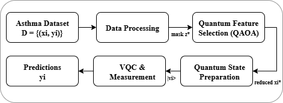
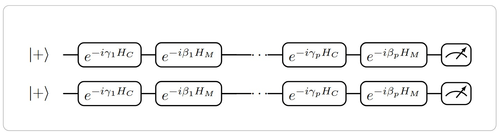
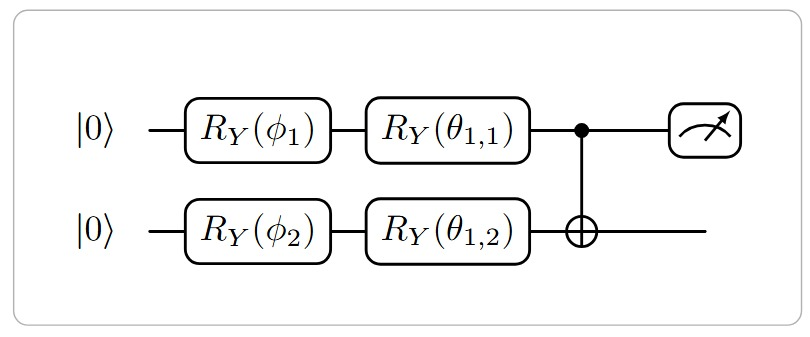

# 🧪 QML-Asthma: Variational Quantum Classifier (PennyLane + PyTorch)

A **hybrid quantum–classical pipeline** for binary asthma diagnosis using **quantum feature selection** and a **variational quantum classifier (VQC)**.

---

## 📊 Overall Hybrid Pipeline

  
*Figure 1. The end-to-end asthma diagnosis pipeline integrates preprocessing, optional quantum feature selection, dimensionality reduction, and a variational quantum classifier.*

---

## ⚛️ Quantum Feature Selection (QFS)

  
*Figure 2. QAOA-based quantum feature selection (QFS). Alternating cost and mixer layers yield a bitstring that represents the selected feature mask \(z^\ast\).*

---

## 🔗 Variational Quantum Classifier (VQC)

  
*Figure 3. VQC structure: angle embedding encodes classical data into quantum states, followed by rotation layers, fixed entanglement, and measurement readout.*

---

## 🚀 Pipeline Workflow

1. **Preprocessing**  
   - Impute missing values  
   - One-hot encode categorical features  
   - Scale continuous variables  

2. **(Optional) Quantum Feature Selection (QAOA)**  
   - Placeholder interface for QFS via Ising/QAOA approach  

3. **Dimensionality Reduction**  
   - PCA → map to rotation angles  

4. **Variational Quantum Classifier**  
   - PennyLane implementation of VQC  
   - Optimized with gradient-based methods  

5. **Training & Evaluation**  
   - Loss: `BCEWithLogitsLoss` with class imbalance handling  
   - Metrics: Accuracy, Precision, Recall, F1-score, ROC-AUC  

---

## ⚡ Quickstart

```bash
# Create virtual environment
python -m venv .venv && source .venv/bin/activate  # (Windows: .venv\Scripts\activate)

# Install dependencies
pip install -r requirements.txt

# Run training
python scripts/run_train.py \
  --csv /path/to/asthma_disease_data.csv \
  --seed 42 \
  --test-size 0.2 \
  --n-qubits 6 \
  --epochs 60 \
  --batch-size 32 \
  --lr 0.02 \
  --enable-qfs false     # set true when you plug in a real QAOA/Ising QFS
